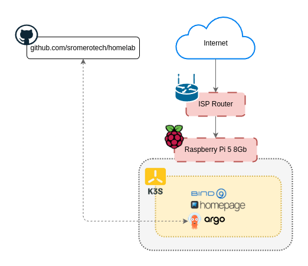

# Homelab

Almost everything needed to set up my personal servers. Inspired by [ChristianLempa](https://github.com/ChristianLempa)'s wonderful repository.

    
    
    
    
    
    

  

## Current Issues

- DNS `Bind9 -> Pihole` chain makes **Pihole** to register all queries as the same client (`10-42-0-79.bind-service.dns.svc.cluster.local`).
- **Pihole** seems not to be blocking **custom domains**.
- `LoadBalancer` services in **K3S** exposes ports on the raspberry despite **UFW** not defining it.
