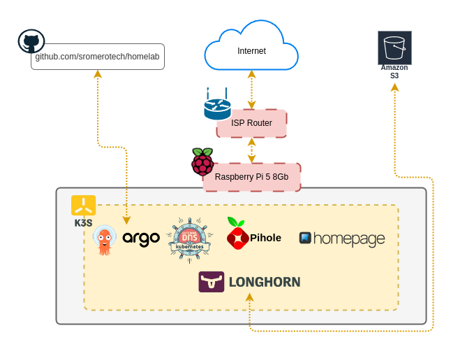
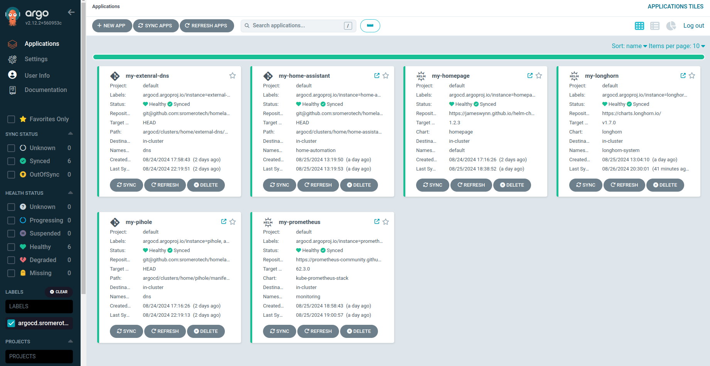

# Homelab

Almost everything needed to set up my personal servers. Inspired by [ChristianLempa](https://github.com/ChristianLempa)'s wonderful repository.

    
    
    
    
    
    

  

## Current Issues

- [[Bug] Pihole registers all queries from the same client.](https://github.com/sromerotech/homelab/issues/1)
- [[Bug] Pihole dns blocking doesn't work.](https://github.com/sromerotech/homelab/issues/2)
- [[Bug] LoadBalance port vs UFW.](https://github.com/sromerotech/homelab/issues/3)

## Guides

- [Installation](docs/installation.md)

## Media

  
   
  
   
  
   
  

